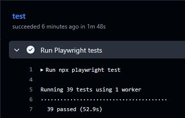
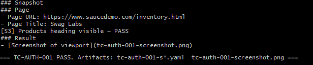

# AI-Augmented QA Automation — SauceDemo

**Claude Code + Playwright MCP (Planner / Generator / Healer / CLI Playbooks)**

---

## Overview

This project demonstrates a full AI-augmented QA workflow — from requirements to deterministic browser automation — using **Claude Code**, **Playwright**, and **SauceDemo** as the system under test.

Five phases: structured test planning → automated spec generation → real-world debugging → self-healing demo → agent-executable CLI playbooks with live browser execution.

---

## Architecture

```
PRD
 │
 ▼
Planner Agent ──────────────── prd/ · test-plans/
 │
 ▼
Structured Test Plan (10 TCs)
 │
 ▼
Generator Agent ─────────────── tests/*.spec.ts
 │
 ▼
Playwright Test Suite
 │
 ├── Debug & Fix ──────────────── 39/39 passing on main
 │
 ├── Healer Agent ─────────────── demo/healer-selector-drift
 │
 ▼
CLI Playbooks ───────────────── procedures/ · scripts/
 │
 ▼
Deterministic Browser Automation
```

---

## Quick Start

**Run the Playwright suite:**
```bash
npm install
npx playwright install
npx playwright test
```

**Run a CLI playbook (single test case):**
```bash
bash scripts/tc-auth-001.sh
```

**Run a CLI playbook in headed mode (visible browser):**
```bash
# Edit the open command in the script to add --headed, then run:
bash scripts/tc-auth-001.sh
```

---

## Project Structure

```
prd/                          # Product requirements document
test-plans/                   # AI-generated structured test plan
tests/                        # Playwright TypeScript specs (39 tests)
  auth.spec.ts
  inventory.spec.ts
  cart.spec.ts
  checkout.spec.ts
  negative.spec.ts
procedures/                   # 10 markdown playbooks (agent-readable)
  TC-AUTH-001_*.md
  TC-INV-001_*.md
  ...
scripts/                      # 10 executable shell runners (one per TC)
  tc-auth-001.sh
  tc-inv-001.sh
  ...
playwright.config.ts          # testIdAttribute: 'data-test'
.claude/                      # Claude Code skills and agent config
```

---

## Workflow

### 1. Planner Agent — PRD → Test Plan

Converted a PRD into a structured, generator-ready test plan with 10 test cases across 5 suites — including scope, stable locator strategy, boundary and negative scenarios, and an AI Healer simulation annotation.

---

### 2. Generator Agent — Test Plan → Playwright Specs

Produced 5 TypeScript spec files with `getByTestId()` aligned to SauceDemo's `data-test` attributes, independent tests, event-driven synchronization, and trace/screenshot on failure.

---

### 3. Debugging — Stable Baseline

Two real-world issues surfaced and resolved on the first generated run:

- **Test ID mismatch** — SauceDemo uses `data-test`; Playwright defaults to `data-testid`. Fixed in `playwright.config.ts`.
- **Currency assertion brittleness** — UI rendered `$0` instead of `$0.00`. Replaced with a resilient regex.

**Result: 39 / 39 tests passing on `main`.**



---

### 4. Healer Demo — Simulated Selector Drift

Branch `demo/healer-selector-drift` demonstrates an intentional locator break, a failing test state, and an AI-assisted repair — restoring green execution while keeping `main` stable.

---

### 5. CLI Playbooks — Agent-Executable Procedures

The final phase moves beyond test code into agent-operable runbooks grounded in live accessibility tree inspection.

**`procedures/` — 10 markdown playbooks:**
- Snapshot-driven: every interaction is preceded by a named `--filename=` snapshot
- Refs resolved via `grep` from the accessibility tree YAML — no hardcoded selectors
- Corrections applied from real execution: cart link invisible in accessibility tree (uses `goto`), error banners are `heading [level=3]` elements, cart badge is `generic [ref=eXX]: "1"` in the first ~15 snapshot lines
- TC-AI-001 includes a **Drift Recovery Notes** section for badge locator drift

**`scripts/` — 10 companion shell scripts:**
- `set -euo pipefail` — fail fast on any broken step
- Named artifacts per run: `tc-auth-001-s1-login.yaml`, `tc-auth-001-screenshot.png`
- Inline pass/fail guards with actionable exit messages
- Run from project root: `bash scripts/tc-auth-001.sh`

**Live execution verified:** TC-AUTH-001 executed end-to-end in both headless and headed (`--headed`) mode. All refs resolved from real snapshots, login confirmed via URL and accessibility tree, screenshot and trace captured.

### Example CLI Playbook Execution

Below is a real execution of `TC-AUTH-001` using the Playwright CLI playbook.



---

## Key Techniques

| Technique | Where |
|---|---|
| PRD → structured test plan via AI | `prd/` → `test-plans/` |
| Plan → deterministic Playwright spec generation | `tests/` |
| Test ID config mismatch diagnosis | `playwright.config.ts` |
| Assertion brittleness fix (regex over exact text) | `tests/negative.spec.ts` |
| Simulated UI drift + AI-assisted repair | `demo/healer-selector-drift` branch |
| Accessibility tree analysis (live snapshot inspection) | `procedures/` |
| Snapshot-driven CLI execution with live ref resolution | `scripts/` |
| Agent-executable runbooks | `procedures/` + `scripts/` |

---

## Locator Strategy

Priority: `getByTestId()` → `getByRole()` → `getByLabel()` → `getByText()` (assertion-only)

No positional selectors · no brittle CSS chains · event-driven waits · assertions validate user-visible evidence: URL, headings, badge counts, error text.
